# Database ERD (Mermaid)

Tai lieu nay mo ta schema database hien tai dua tren:

- `examxy.Infrastructure/Persistence/AppDbContext.cs`
- `examxy.Infrastructure/Persistence/Migrations/AppDbContextModelSnapshot.cs`

```mermaid
erDiagram
    AspNetUsers {
        string Id PK
        string Email
        string UserName
        string FullName
        datetime CreatedAtUtc
    }
    RefreshTokens {
        guid Id PK
        string UserId FK
        string Token
        datetime ExpiresAtUtc
        datetime RevokedAtUtc
    }
    TeacherProfiles {
        string UserId PK, FK
    }
    StudentProfiles {
        string UserId PK, FK
    }

    Classrooms {
        guid Id PK
        string OwnerTeacherUserId FK
        string Name
        string JoinCode
        string Status
    }
    ClassMemberships {
        guid Id PK
        guid ClassId FK
        string StudentUserId FK
        string Status
    }
    ClassInvites {
        guid Id PK
        guid ClassId FK
        string StudentUserId FK
        string UsedByUserId FK
        string InviteCode
        string Status
    }
    StudentImportBatches {
        guid Id PK
        guid ClassId FK
        string TeacherUserId FK
        string Status
    }
    StudentImportItems {
        guid Id PK
        guid BatchId FK
        string StudentUserId FK
        guid ClassInviteId FK
        string Status
    }

    ClassPosts {
        guid Id PK
        guid ClassId FK
        string AuthorUserId
        string ContentPlainText
        datetime CreatedAtUtc
    }
    ClassPostAttachments {
        guid Id PK
        guid PostId FK
        string AttachmentType
        string StorageKey
    }
    ClassComments {
        guid Id PK
        guid ClassId FK
        guid PostId FK
        string AuthorUserId
        string ContentPlainText
    }
    ClassPostReactions {
        guid Id PK
        guid PostId FK
        string UserId
        string ReactionType
    }
    ClassCommentReactions {
        guid Id PK
        guid CommentId FK
        string UserId
        string ReactionType
    }
    ClassPostMentionUsers {
        guid Id PK
        guid PostId FK
        string MentionedUserId
    }
    ClassPostMentionAll {
        guid PostId PK, FK
    }
    ClassCommentMentionUsers {
        guid Id PK
        guid CommentId FK
        string MentionedUserId
    }
    ClassCommentMentionAll {
        guid CommentId PK, FK
    }
    ClassScheduleItems {
        guid Id PK
        guid ClassId FK
        string Title
        datetime StartAtUtc
    }
    ClassNotifications {
        guid Id PK
        guid ClassId FK
        string RecipientUserId
        string EventType
    }

    QuestionBankQuestions {
        guid Id PK
        string OwnerTeacherUserId
        string CurrentStatus
        datetime CreatedAtUtc
    }
    QuestionBankQuestionVersions {
        guid Id PK
        guid QuestionId FK
        string QuestionType
        string StemPlainText
    }
    QuestionBankTags {
        guid Id PK
        string OwnerTeacherUserId
        string Name
    }
    QuestionBankQuestionTags {
        guid QuestionId PK, FK
        guid TagId PK, FK
    }
    QuestionBankAttachments {
        guid Id PK
        guid QuestionVersionId FK
        string StorageKey
        string MimeType
    }

    ClassAssessments {
        guid Id PK
        guid ClassId FK
        string OwnerTeacherUserId
        string Title
        string Status
    }
    ClassAssessmentItems {
        guid Id PK
        guid AssessmentId FK
        int DisplayOrder
        guid SourceQuestionId FK
        guid SourceQuestionVersionId FK
    }
    StudentAssessmentAttempts {
        guid Id PK
        guid AssessmentId FK
        guid ClassId FK
        string StudentUserId
        int AttemptNumber
        string Status
    }
    StudentAssessmentAnswers {
        guid Id PK
        guid AttemptId FK
        guid AssessmentItemId FK
        string AnswerJson
        decimal EarnedPoints
    }

    AspNetUsers ||--o{ RefreshTokens : has
    AspNetUsers ||--|| TeacherProfiles : has
    AspNetUsers ||--|| StudentProfiles : has

    AspNetUsers ||--o{ Classrooms : owns
    Classrooms ||--o{ ClassMemberships : has
    Classrooms ||--o{ ClassInvites : has
    Classrooms ||--o{ StudentImportBatches : has
    StudentImportBatches ||--o{ StudentImportItems : has
    ClassInvites o|--o{ StudentImportItems : linked

    Classrooms ||--o{ ClassPosts : has
    ClassPosts ||--o{ ClassPostAttachments : has
    ClassPosts ||--o{ ClassComments : has
    ClassPosts ||--o{ ClassPostReactions : has
    ClassComments ||--o{ ClassCommentReactions : has
    ClassPosts ||--o{ ClassPostMentionUsers : has
    ClassPosts ||--|| ClassPostMentionAll : has
    ClassComments ||--o{ ClassCommentMentionUsers : has
    ClassComments ||--|| ClassCommentMentionAll : has
    Classrooms ||--o{ ClassScheduleItems : has
    Classrooms ||--o{ ClassNotifications : has

    QuestionBankQuestions ||--o{ QuestionBankQuestionVersions : has
    QuestionBankQuestions ||--o{ QuestionBankQuestionTags : has
    QuestionBankTags ||--o{ QuestionBankQuestionTags : has
    QuestionBankQuestionVersions ||--o{ QuestionBankAttachments : has

    Classrooms ||--o{ ClassAssessments : has
    ClassAssessments ||--o{ ClassAssessmentItems : has
    ClassAssessments ||--o{ StudentAssessmentAttempts : has
    StudentAssessmentAttempts ||--o{ StudentAssessmentAnswers : has
    ClassAssessmentItems ||--o{ StudentAssessmentAnswers : answered_by
    QuestionBankQuestions o|--o{ ClassAssessmentItems : source
    QuestionBankQuestionVersions o|--o{ ClassAssessmentItems : source_version
```

## Notes

- Diagram nay uu tien cac bang nghiep vu va quan he chinh de doc nhanh.
- Identity subsystem (`AspNetUserRoles`, `AspNetUserClaims`, ...) duoc rut gon de tranh qua tai so do.
- Khi schema doi, cap nhat file nay cung luc voi migration.

