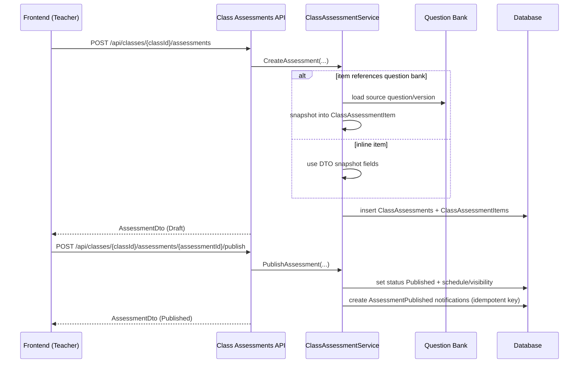
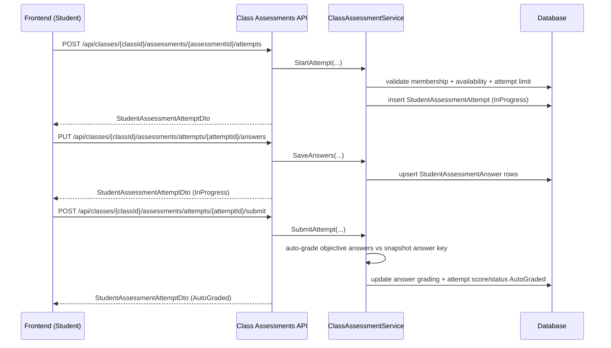

# API Flow - Assessment

## Teacher Create -> Publish

## Student Attempt -> Submit -> Auto-grade

## Key Rules

- assessment content editable only while `Draft`.
- sau publish:
  - lock content/items
  - chi schedule/visibility update qua publish endpoint.
- attempt limit enforced before new attempt.
- auto-grade objective types; non-objective backlog manual grading.
