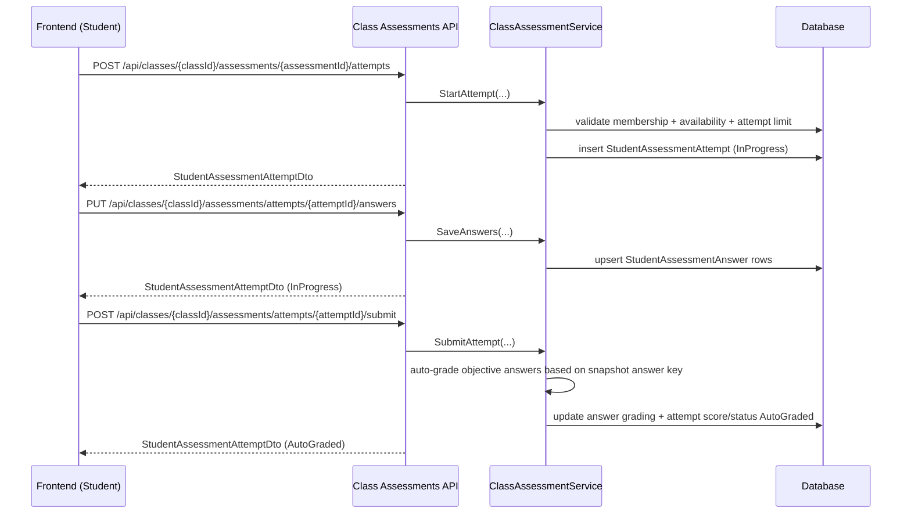
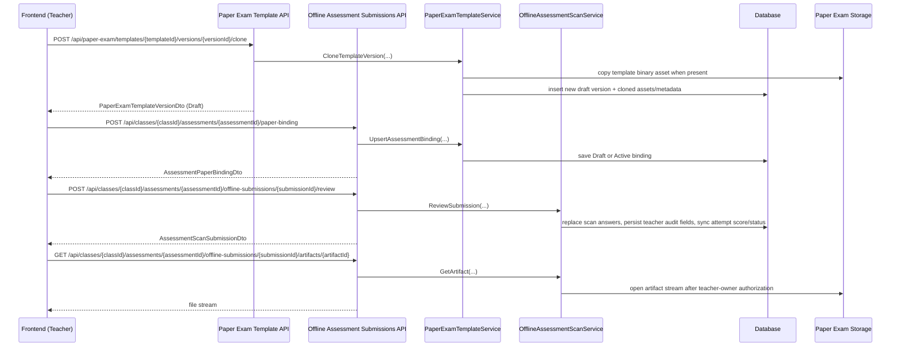

# API Flow - Assessment

## Teacher Create -> Publish

## Student Attempt -> Submit -> Auto-grade

## Teacher Paper Exam Template -> Binding -> Review

## Key Rules

- Assessment content is editable only while in `Draft` status.
- After publishing:
  - Content/items are locked.
  - Only schedule/visibility can be updated via the publish endpoint.

- Attempt limits are enforced before creating a new attempt.
- Timed attempts are enforced on both answer save and submit from the saved `StartedAtUtc` plus `TimeLimitMinutesSnapshot`; expired attempts return `assessment_attempt_expired`.
- Objective questions are auto-graded; non-objective questions require manual grading (backlog).
- Teacher paper-binding reads return the current binding for the teacher owner, including `Draft`.
- Published paper template versions are immutable; edits continue through clone-to-draft.
- Paper submission review persists `TeacherNote`, `ReviewedByTeacherUserId`, `ReviewedAtUtc`, and can finalize in the same review request.
- Paper scanner submission rejects malformed JSON, duplicate/out-of-range question numbers, required metadata gaps, binding version mismatch, config hash mismatch, and schema mismatch before creating submission rows.
