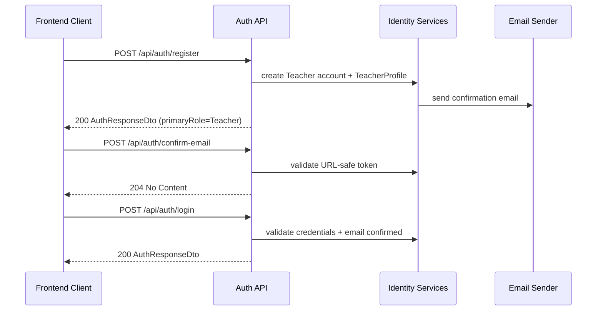
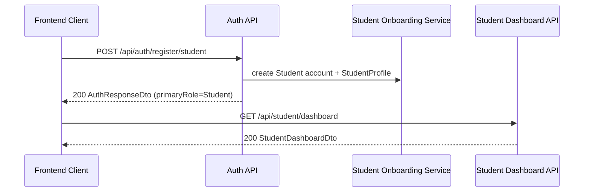
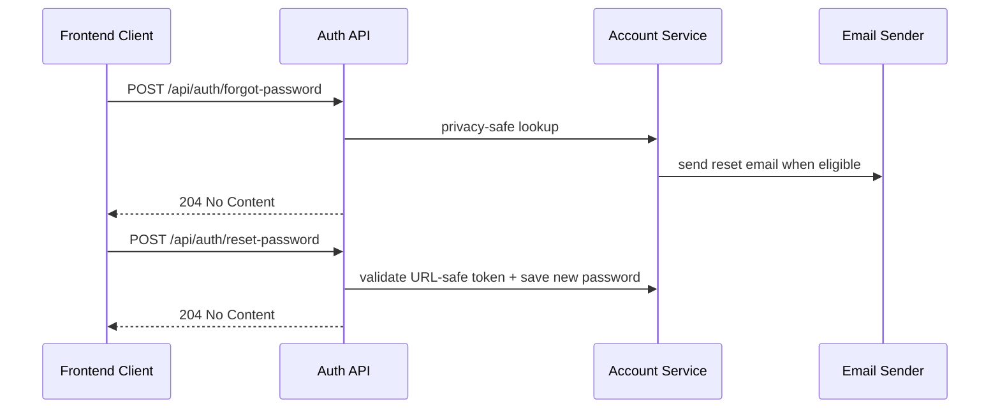
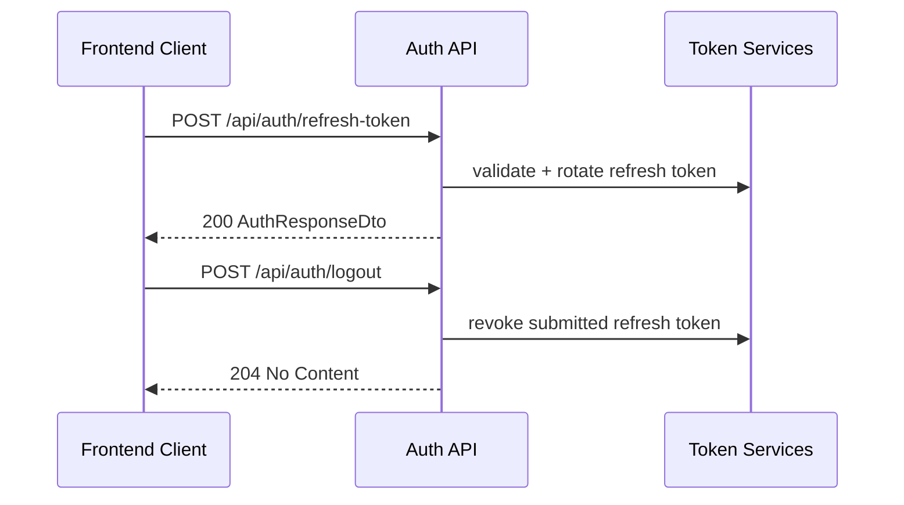

# API Flow - Authentication

## When to use this flow

Doc nay dung khi can hieu trinh tu goi API cho:

- teacher self-signup
- student self-signup
- confirm email
- login
- forgot/reset password
- refresh token
- logout

## Teacher register -> confirm email -> login

## Student self-signup -> dashboard

## Forgot password -> reset password

## Refresh token -> logout

## Related endpoints

- `POST /api/auth/register`
- `POST /api/auth/register/student`
- `POST /api/auth/login`
- `POST /api/auth/refresh-token`
- `POST /api/auth/logout`
- `GET /api/auth/me`
- `POST /api/auth/forgot-password`
- `POST /api/auth/reset-password`
- `POST /api/auth/confirm-email`
- `POST /api/auth/resend-email-confirmation`

## Failure points

- `login` tra `403` khi email chua duoc confirm.
- `register` va `register/student` tra `409` khi username hoac email da ton tai.
- `refresh-token` tra `401` hoac `404` khi token pair khong hop le.
- `forgot-password` va `resend-email-confirmation` giu behavior privacy-safe, nen van tra `204` trong nhieu truong hop khong gui email.
