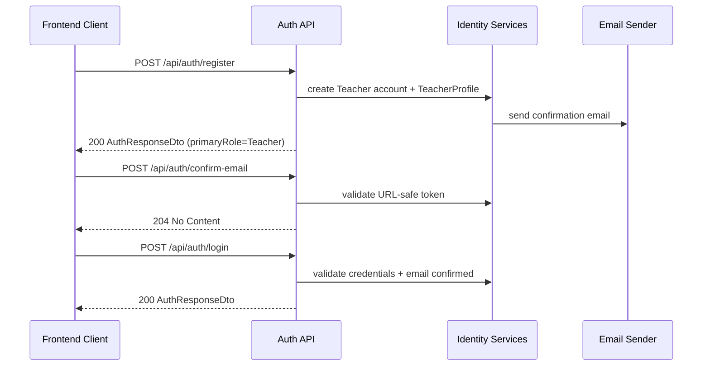
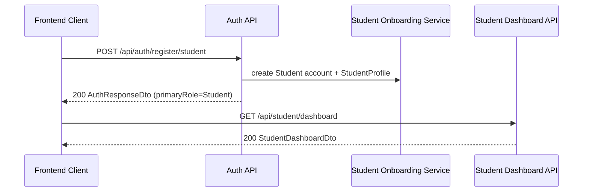
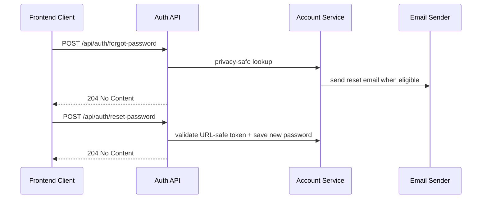
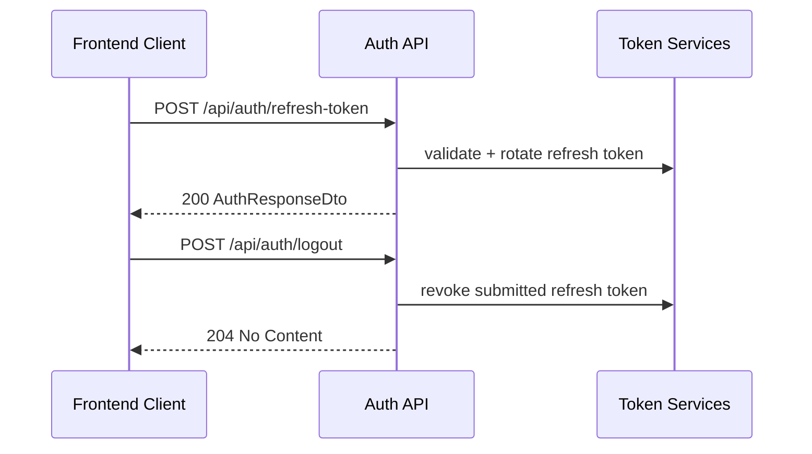

# API Flow - Authentication

## When to use this flow

This document is used to understand the API call sequence for:

- teacher self-signup
- student self-signup
- confirm email
- login
- forgot/reset password
- refresh token
- logout

## Teacher register -> confirm email -> login

## Student self-signup -> dashboard

## Forgot password -> reset password

## Refresh token -> logout

## Related endpoints

- `POST /api/auth/register`
- `POST /api/auth/register/student`
- `POST /api/auth/login`
- `POST /api/auth/refresh-token`
- `POST /api/auth/logout`
- `GET /api/auth/me`
- `POST /api/auth/forgot-password`
- `POST /api/auth/reset-password`
- `POST /api/auth/confirm-email`
- `POST /api/auth/resend-email-confirmation`

## Failure points

- `login` returns `403` when the email is not confirmed.
- `register` and `register/student` return `409` when the username or email already exists.
- `refresh-token` returns `401` or `404` when the token pair is invalid.
- `forgot-password` and `resend-email-confirmation` follow privacy-safe behavior, so they may still return `204` even when no email is sent.
