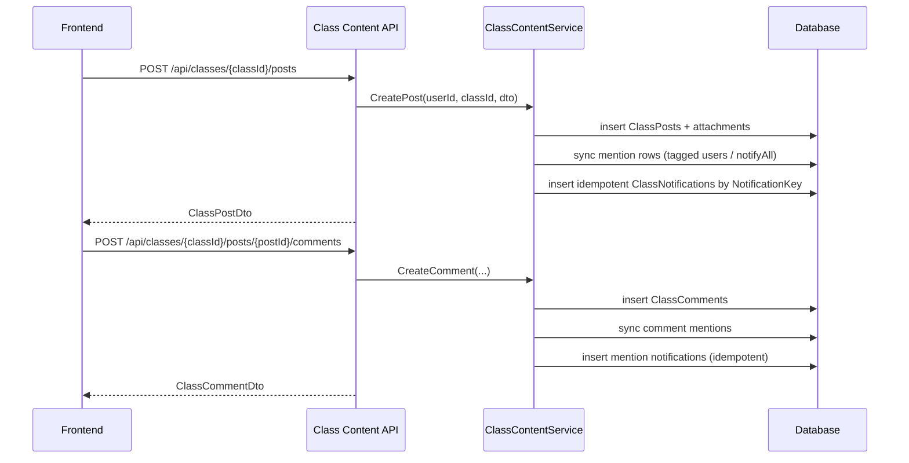
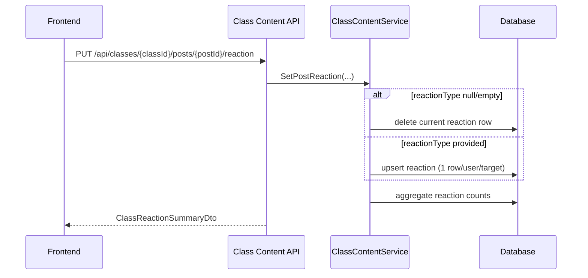
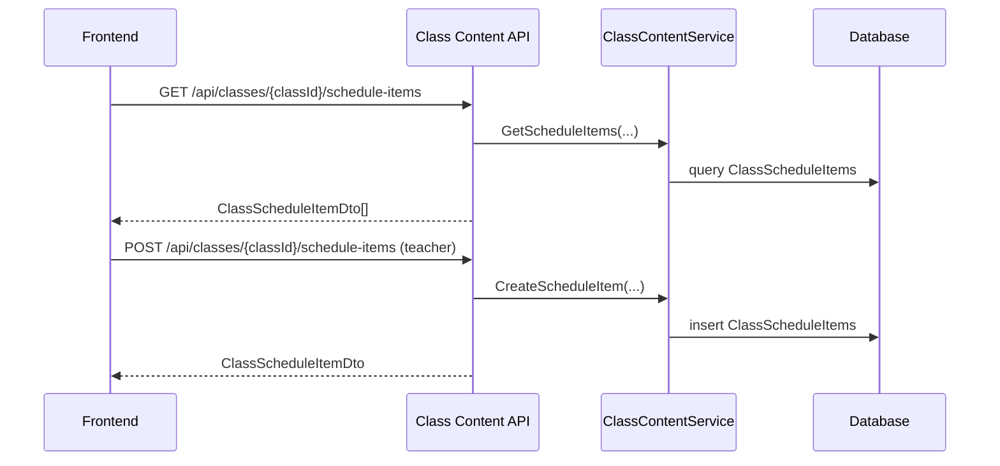

# API Flow - Class Content

## Post + Comment + Mention + Notification

## Reaction Flow

## Schedule Flow

## Access Checks

- teacher owner: full read/write
- student active member: read feed/dashboard/schedule + comment/react
- non-member: forbidden/not found
- draft/unpublished posts khong visible cho student

## Idempotency

- notification rows unique by `NotificationKey`
- update/retry cung context khong tao duplicate notification
