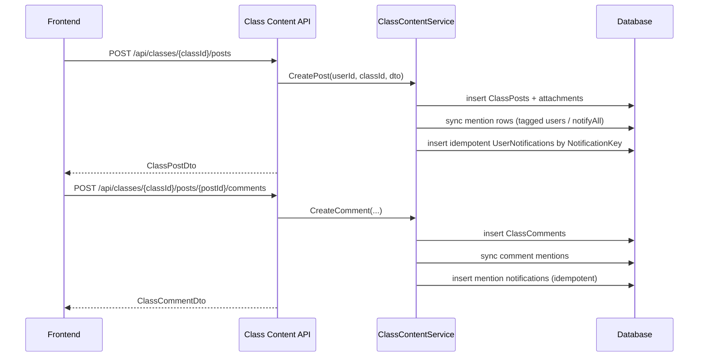
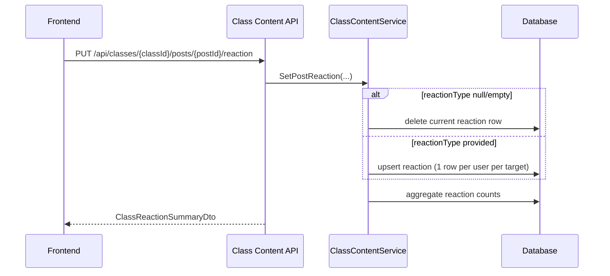
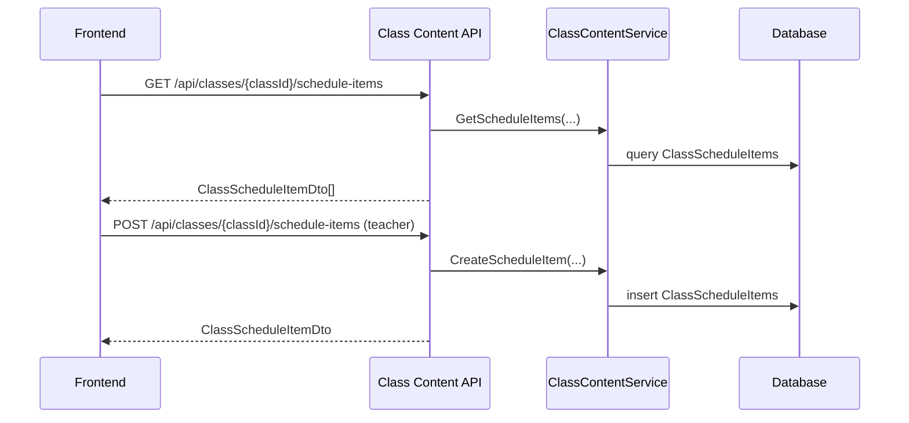

# API Flow - Class Content

## Post + Comment + Mention + Notification



````

## Reaction Flow



## Schedule Flow



## Access Checks

- Teacher (owner): full read/write access
- Student (active member): can read feed/dashboard/schedule + comment/react
- Non-member: forbidden or not found
- Draft/unpublished posts are not visible to students

## Mention Candidates

- `GET /api/classes/{classId}/mention-candidates`
- Authorization is the same as feed/dashboard:
  - Teacher (owner): allowed to retrieve list
  - Student (active member): allowed to retrieve list
  - Non-member: `403`

- Response includes class participants (excluding the current actor):
  - `userId`
  - `displayName`
  - `email`

## Idempotency

- Notification rows are unique by `NotificationKey`
- Repeated updates/retries with the same context do not create duplicate notifications
- The canonical notification inbox API is located at `/api/notifications`
````
