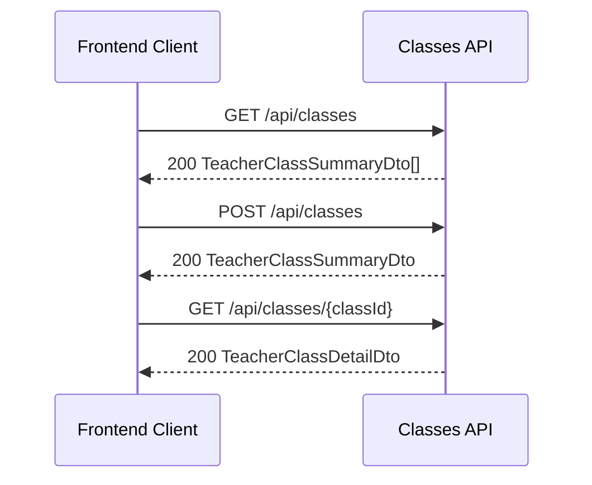
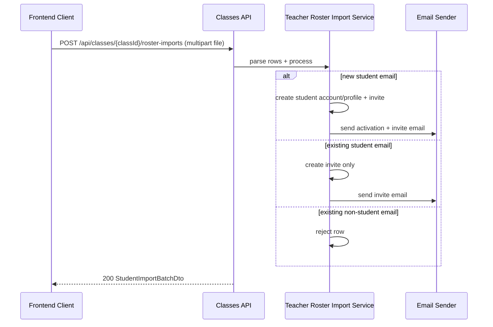
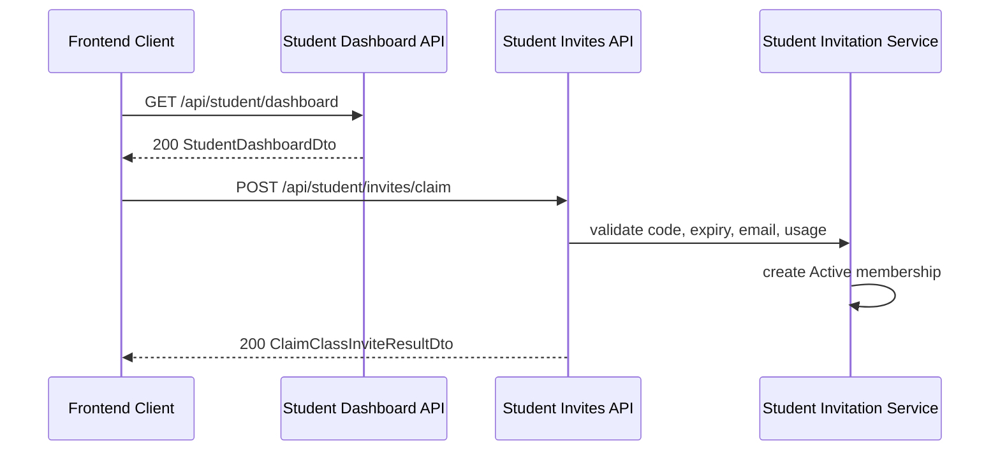

# API Flow - Classrooms Foundation

## Scope

Flow nay cover class foundation:

- teacher class CRUD
- roster import + add one student
- invite resend/cancel/claim
- student dashboard hydration

Class content + assessments co flow docs rieng:

- `api-flow-class-content.md`
- `api-flow-assessment.md`

## Teacher create class -> open detail

## Teacher roster import

## Student dashboard -> claim invite

## Endpoints

- `GET /api/classes`
- `POST /api/classes`
- `GET /api/classes/{classId}`
- `PUT /api/classes/{classId}`
- `DELETE /api/classes/{classId}`
- `POST /api/classes/{classId}/roster-imports`
- `POST /api/classes/{classId}/students`
- `DELETE /api/classes/{classId}/memberships/{membershipId}`
- `POST /api/classes/{classId}/invites/{inviteId}/resend`
- `POST /api/classes/{classId}/invites/{inviteId}/cancel`
- `GET /api/student/dashboard`
- `POST /api/student/invites/claim`

## Failure Points

- teacher truy cap class cua teacher khac -> `404`
- xoa membership khong thuoc class owner -> `404`
- resend/cancel invite `Used` hoac `Cancelled` -> `409`
- roster import file invalid format -> `400`
- invite claim sai/expired/used/email mismatch -> `409` hoac `403`
- policy sai role -> `403`
