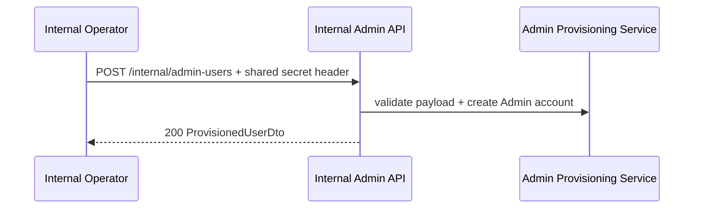
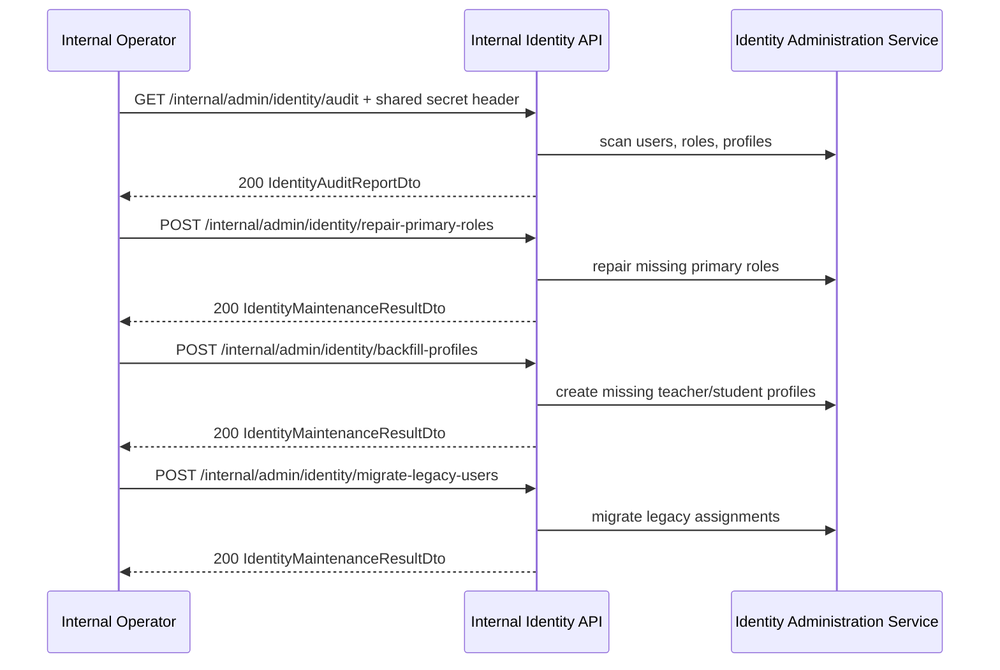

# API Flow - Internal Admin

## When to use this flow

This document is used for internal operational flows:

- provision admin accounts
- audit identity integrity
- repair/backfill/migrate identity data

All endpoints in this document require a shared secret header from `InternalAdminProvisioning`.

## Provision admin account

## Audit -> repair/backfill/migrate

## Related endpoints

- `POST /internal/admin-users`
- `GET /internal/admin/identity/audit`
- `POST /internal/admin/identity/repair-primary-roles`
- `POST /internal/admin/identity/backfill-profiles`
- `POST /internal/admin/identity/migrate-legacy-users`

## Failure points

- Missing or invalid shared secret header returns `403`.
- Provision admin returns `409` if username or email already exists.
- Maintenance endpoints are internal-only operational tools, not part of the public client contract.
