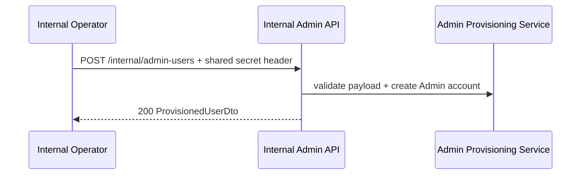
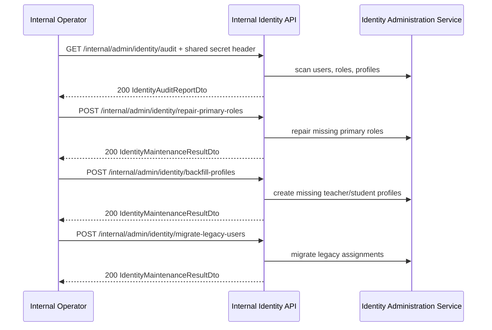

# API Flow - Internal Admin

## When to use this flow

Doc nay dung cho cac luong van hanh noi bo:

- provision tai khoan admin
- audit integrity cua identity
- repair/backfill/migrate du lieu identity

Tat ca endpoint trong doc nay deu yeu cau secret header tu `InternalAdminProvisioning`.

## Provision admin account

## Audit -> repair/backfill/migrate

## Related endpoints

- `POST /internal/admin-users`
- `GET /internal/admin/identity/audit`
- `POST /internal/admin/identity/repair-primary-roles`
- `POST /internal/admin/identity/backfill-profiles`
- `POST /internal/admin/identity/migrate-legacy-users`

## Failure points

- Thieu hoac sai shared secret header tra `403`.
- Provision admin tra `409` neu username hoac email da ton tai.
- Maintenance endpoints la internal-only operational tooling, khong phai public client contract.
